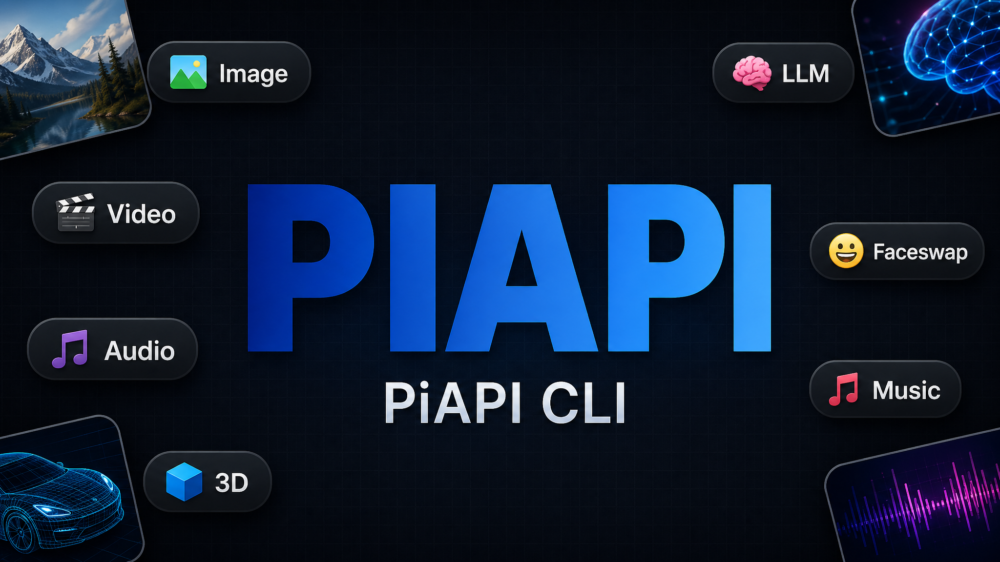
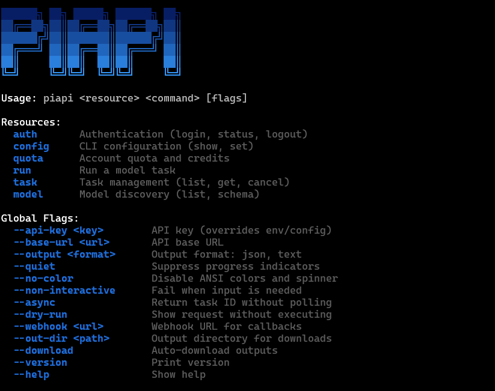

<p align="center">
  
</p>

<p align="center">
  <strong>piapi — 一个二进制，94 个多模态 AI 模型</strong><br>
  在终端或 AI Agent 中生成图像、视频、音频、3D，以及与 LLM 对话。
</p>

<p align="center">
  <a href="README.md">English</a> · <a href="https://piapi.ai">PiAPI</a> · <a href="https://piapi.ai/docs">文档</a> · <a href="skill/SKILL.md">Agent Skill</a>
</p>

## 能力概览

- **图像** — 34 个模型，包括 `flux-dev`、`nano-banana-pro`、`qwen-image-edit`、`seedream-5-lite`、`midjourney`，以及工具类（`remove-bg`、`upscale`、`segment`、`joycaption`、`faceswap`）
- **视频** — 40 个模型，包括 `sora2-pro`、`kling-3`、`veo3-fast`、`wanx22`、`seedance-2`、`hailuo`、`luma`
- **音频** — 10 个模型，包括 `mmaudio`（视频转音频）、`f5-tts`、`diffrhythm`、`udio-music`、`ace-step`
- **3D** — `trellis`（文本转 3D）、`trellis2`（图片转 3D）
- **LLM** — 8 个对话模型，包括 `gpt-4o`、`claude-sonnet-4.6`、`gpt-5`，以及 `gpt-image-2`（OpenAI 兼容图像生成）
- **流式输出** — `--stream` 让 LLM 按 token 流式返回；SSE-only 模型（如 `sora2-preview`）默认流式
- **文件 I/O** — `key=@./local.png` 自动上传本地文件；`--download` 自动保存所有 URL 或 `b64_json` 输出
- **双 API 接口** — 媒体生成走 Unified Task API，LLM 与 `gpt-image-2` 走 OpenAI 兼容接口。所有条目均与 PiAPI 文档核对；`piapi model list` 查看实时目录。

## 安装

```bash
npm install -g piapi-cli      # npm
pnpm add -g piapi-cli         # pnpm
bun add -g piapi-cli          # bun
yarn global add piapi-cli     # yarn
```

或者不安装直接运行：

```bash
npx piapi-cli@latest --help
```

需要 [Node.js](https://nodejs.org) 18+。

<p align="center">
  
</p>

## 快速开始

```bash
# 登录
piapi auth login --api-key sk-xxxxx

# 生成图片
piapi run flux-dev prompt="一只柯基在太空"
piapi run gpt-image-2 prompt="一只柯基在太空" size=1024x1024

# 与 LLM 对话（按 token 流式）
piapi run gpt-4o prompt="解释 JavaScript 的 async/await" --stream
piapi run claude-sonnet-4.6 prompt="把这封邮件改得更简洁" system="你是写作教练"

# 生成视频（异步）
piapi run sora2-pro prompt="海浪" --async

# 上传本地文件 → 运行 → 自动下载结果
piapi run remove-bg image=@./photo.png --download --out-dir ./out

# 查看配额与目录
piapi quota
piapi model list --type video
```

## 命令

### piapi run \<model\> key=value...

使用 `key=value` 输入运行任意模型。视频和 3D 模型需要 `--async`。
LLM 与 `gpt-image-2` 走 OpenAI 兼容接口（同步，无需轮询），其他模型走
Unified Task API。

```bash
piapi run flux-dev prompt="一只柯基" aspect_ratio=16:9 num_outputs=4
piapi run kling-3 prompt="日落" duration=5
piapi run sora2-pro prompt="海浪" --async
piapi run gpt-image-2 prompt="一个机器人" size=1024x1024
piapi run gpt-4o prompt="你好" --stream
piapi run flux-dev prompt="测试" --dry-run
```

**本地文件** — 输入值前加 `@` 即在请求前自动上传：

```bash
piapi run remove-bg image=@./photo.png --download --out-dir ./out
piapi run faceswap source=@./face.jpg target=@./scene.png --async
```

文件上传需要 PiAPI 付费套餐。加 `--download` 自动把所有 URL（以及
`gpt-image-2` 参考图编辑返回的 base64）保存到 `--out-dir`（默认当前目录）。

### piapi task

```bash
piapi task list
piapi task get <id>
piapi task cancel <id>   # 仅部分提供方支持（Kling/Midjourney）；v1 会返回提示
```

### piapi model

```bash
piapi model list
piapi model list --type video
piapi model schema flux-dev
```

### piapi auth

```bash
piapi auth login --api-key sk-xxxxx
piapi auth status
piapi auth logout
```

> 💡 共享机器上建议用 `export PIAPI_API_KEY=sk-...`，避免 `--api-key` 通过 `ps` 暴露给其他用户。

### piapi config

```bash
piapi config show
piapi config set --key apiKey --value sk-xxxxx
```

### piapi quota

```bash
piapi quota
```

## 全局参数

| 参数 | 说明 |
|---|---|
| `--api-key <key>` | API 密钥（覆盖环境变量/配置文件） |
| `--base-url <url>` | API 基础 URL |
| `--output json` | JSON 格式输出到 stdout |
| `--quiet` | 抑制进度指示器 |
| `--non-interactive` | 缺少输入时直接失败 |
| `--async` | 立即返回任务 ID |
| `--stream` | 流式输出 LLM token（仅 openai-completions 模型） |
| `--dry-run` | 预览请求不执行 |
| `--webhook <url>` | 回调 Webhook URL |
| `--out-dir <path>` | 下载目录 |
| `--download` | 任务完成时自动下载 |
| `--no-color` | 关闭 ANSI 颜色（亦遵循 `NO_COLOR` 环境变量） |

## 配置

配置文件位于 `~/.piapi/config.json`：

```json
{
  "apiKey": "sk-...",
  "baseUrl": "https://api.piapi.ai"
}
```

优先级：CLI 参数 → 环境变量 → 配置文件 → 默认值。

| 变量 | 用途 |
|---|---|
| `PIAPI_API_KEY` | API 密钥 |
| `PIAPI_BASE_URL` | 覆盖 API 基础 URL |
| `PIAPI_TIMEOUT_MS` | 覆盖请求超时（默认 API 30s / 上传下载 60s） |
| `PIAPI_NO_UPDATE_CHECK` | 关闭每日 npm 版本检查 |
| `NO_COLOR` | 关闭 ANSI 颜色（任意非空值） |

## AI Agent 集成

适用于 Claude Code、Cursor 等 Agent：

```bash
npx skills add PiAPI-1/piapi-cli
```

完整 Agent Skill 规范见 [`skill/SKILL.md`](skill/SKILL.md)。

## License

MIT
